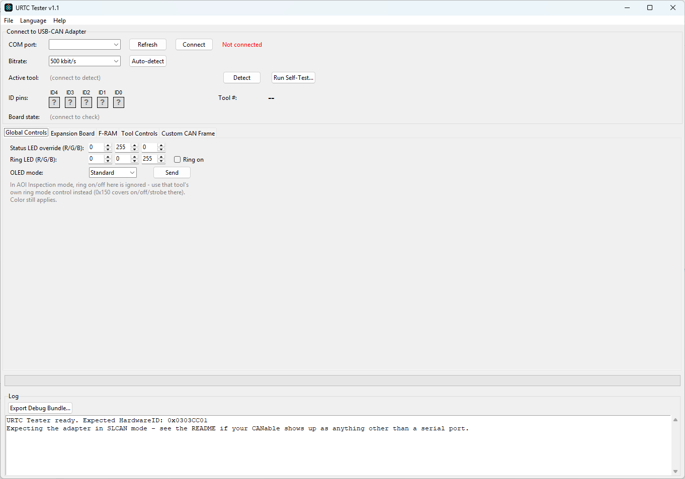

<p align="center">
  
</p>

# URTC Tester (Windows / Linux)

<p align="center">
  <a href="README.md">🇺🇸 English</a> |
  🇪🇸 <b>Español</b> |
  <a href="README_fra.md">🇫🇷 Français</a> |
  <a href="README_ita.md">🇮🇹 Italiano</a> |
  <a href="README_deu.md">🇩🇪 Deutsch</a> |
  <a href="README_zho.md">🇨🇳 简体中文</a> |
  <a href="README_jpn.md">🇯🇵 日本語</a>
</p>


<p align="left">
  
  
  
  
</p>


**Versión:** 0.1.1 · **Autor:** JuanenRac (Electro Hobby 3D) &lt;electrohobby3d@gmail.com&gt;

Licencia: **GPL-3.0** para el código fuente, **CC BY-SA 4.0** para esta
documentación - ver `LICENSE` en este repositorio, o la sección
"Licencia y Avisos de Copyright" al final de este documento.

Un ejercitador en vivo de bus CAN para la placa URTC. Se conecta por el
mismo adaptador USB-CAN que usa el flasher, le pregunta a la placa para
cuál de sus 25 perfiles de herramienta está configurada actualmente
mediante jumpers, y muestra solo los controles y la telemetría propios
de esa herramienta - no una sola ventana intentando representar las 25 a
la vez. Todo lo que hace es un comando en tiempo de ejecución o una
lectura de telemetría contra la aplicación en ejecución; nunca toca la
flash, así que no hay nada aquí que pueda dejar la placa menos operativa
de lo que estaba al empezar.

## 1. 🆚 Relación con el flasher

Esta herramienta y [URTC Flasher](https://github.com/JuanenRac/URTC-FLASHER) comparten la misma capa de
transporte (las clases SLCAN y SocketCAN son idénticas) ya que ambas en
última instancia solo necesitan meter y sacar tramas CAN del mismo tipo
de adaptador, pero hacen trabajos fundamentalmente distintos:

| | Flasher | Tester |
|---|---|---|
| Toca la flash | Sí (ese es todo el propósito) | Nunca |
| Habla con | El bootloader, mayormente | La aplicación en ejecución |
| Propósito | Actualizar firmware | Ejercitar/verificar el hardware real de un cabezal de herramienta |

Si no estás seguro de cuál necesitas: si la placa ya está ejecutando
firmware y quieres comprobar que una herramienta realmente funciona (el
calentador calienta, el motor gira, el LED se enciende), quieres esta.

## 2. 📦 Instalar y ejecutar

Mismo patrón que el flasher:

```
pip install -r requirements.txt
python urtc_tester.py          # Windows
python3 urtc_tester.py         # Linux
```

O compila un binario independiente: `build_exe.bat` en Windows,
`./build_exe.sh` en Linux. Ambos limpian `build/`/`dist/` primero y
empaquetan `assets/` (el banner y el icono) en el ejecutable - ver el
propio README del flasher para el razonamiento completo detrás de estos
scripts, ya que se aplica idénticamente aquí.

**Versionado:** `TESTER_VERSION` (en `tester_config.py`, mostrado en la
barra de título, el diálogo Acerca de, los logs de sesión y los paquetes
de depuración) sigue el esquema `MAYOR.MENOR.PARCHE`. Ambos scripts de
build lo incrementan automáticamente justo antes de cada build real vía
`bump_version.py`, con regla de "cuentakilómetros" en base 10: PARCHE +1,
y si supera 9 se resetea a 0 y MENOR sube 1 (ej. `0.1.9` → `0.2.0`).
Ejecutar desde el código fuente (`python urtc_tester.py`) nunca lo toca -
solo lo hace una ejecución real de `build_exe.bat`/`build_exe.sh`. MAYOR
nunca sube automáticamente, solo a mano. Ver `CHANGELOG.md` para el
historial de versiones.

**Al arrancar**, el banner se muestra centrado en pantalla durante 5
segundos antes de que aparezca la ventana principal, en vez de vivir
dentro de la ventana misma - igual que el flasher, y por el mismo motivo
(mantiene la ventana en sí compacta). El icono de ventana/barra de
tareas es igualmente un diseño pequeño independiente, no el banner
reducido.

El panel de conexión también muestra la marca animada oficial de HYDRA-UMC.
Su fuente SVG mantenida es `assets/HYDRA_UMC_ICON.svg`; doce fotogramas PNG
incluidos conservan la animación en Tkinter y en el ejecutable autónomo sin
añadir una dependencia gráfica en tiempo de ejecución. El icono nativo URTC
de ventana/barra de tareas se mantiene estático por diseño.

### Panel visual de control

El panel compartido de comandos **Qt Quick** está disponible para conexión
real, monitorización de sólo escucha y una sonda de identidad activada de
forma explícita:
~~~
python urtc_tester.py --qtquick
~~~
Usa los transportes de producción SLCAN/SocketCAN. Inicia en modo sólo
escucha, por lo que no puede transmitir hasta que armes deliberadamente las
comprobaciones activas; esa sonda sólo envía las consultas documentadas de
herramienta activa y versión. La interfaz Tkinter predeterminada sigue siendo
la herramienta completa mientras se migran con seguridad sus 25 paneles.

El flujo consolidado de diagnóstico CAN en vivo usa ahora una superficie de
control azul marino/cian: cabecera de producto, tarjeta de conexión de alto
contraste, pestañas de herramientas claras, registro de sesión oscuro y canal
de progreso visible. Esta mejora visual y de accesibilidad no modifica la
monitorización pasiva, el enrutamiento de comandos ni ningún límite de seguridad.

### Barra de menú

- **Archivo** - Guardar registros (el registro en pantalla como texto
  plano; para un paquete más completo que incluya diagnósticos del
  sistema, ver "Registros y paquetes de depuración" más abajo), y
  Salir.
- **Idioma** - cambia entre los 5 idiomas disponibles (ver "Idioma" más
  arriba para saber cómo funcionan las traducciones).
- **Ayuda** - Readme (abre este archivo en una ventana de solo lectura;
  recoge automáticamente una versión traducida en cuanto exista una para
  el idioma actual), GitHub de URTC (abre el repositorio del proyecto en
  tu navegador), Licencia (la licencia GPL-3.0 de esta herramienta,
  leída desde el propio archivo `LICENSE` del repositorio), y Acerca de
  (versión y autor).

### Estructura de archivos

Esta herramienta está organizada en módulos por responsabilidad,
puramente por legibilidad - no hay ninguna diferencia funcional entre
tenerlos como archivos separados o como uno grande. `tester_config.py`
contiene las constantes de configuración/idioma/protocolo,
`tester_transports.py` contiene SLCAN/SocketCAN, `tester_bus_monitor.py`
contiene el hilo de lectura CAN en segundo plano, y `TesterGUI` misma
está dividida entre `tester_gui_core.py` (conexión, detección, ciclo de
vida de la ventana, y la barra de menú) más 3 mixins que combina:
`tester_common_panels.py` (paneles de controles globales/F-RAM/
expansión/autoprueba/monitor de bus/trama personalizada),
`tester_panel_helpers.py` (utilidades compartidas que usa todo
constructor de panel de herramienta), y `tester_tool_panels.py` (19
constructores de paneles específicos de herramienta, cubriendo los 25
perfiles - varias herramientas comparten un mismo constructor, p. ej.
`_build_motion_panel` por sí solo cubre 7 de ellas). `urtc_tester.py`
ahora es solo el punto de entrada - arranque sin CLI y la pantalla de
bienvenida.

**Idioma**: inglés por defecto. Se cambia mediante el menú **Idioma**
(en la barra de menú en la parte superior de la ventana) en vez de un
desplegable en la ventana principal - cambia la interfaz (etiquetas,
botones, diálogos, y mensajes de registro) a cualquiera de los 5 idiomas
disponibles, se guarda inmediatamente en `config.json` junto a esta
herramienta, y se aplica en el siguiente arranque. Las traducciones
viven en archivos de texto plano bajo `language/` (`english.lng`,
`spanish.lng`, `italian.lng`, `french.lng`, `german.lng`) como pares
simples `CLAVE=Valor`, uno por línea - las líneas que empiezan con `#` y
las líneas en blanco se ignoran, y un `\n` literal dentro de un valor se
convierte en un salto de línea real (usado por el puñado de mensajes de
diálogo multilínea). Editable directamente si una traducción necesita
corregirse, o como punto de partida para otro idioma (añade
`language/<nombre>.lng`, añade `("<nombre>", "Nombre Nativo")` a
`AVAILABLE_LANGUAGES` cerca del principio de `tester_config.py`, y pon
`"language": "<nombre>"` en `config.json`). Una clave que falte en un
archivo de idioma cae de vuelta a mostrar el nombre de esa misma clave
en vez de fallar, y un archivo de idioma ausente o ilegible (edición
defectuosa, nombre de archivo equivocado) cae de vuelta al inglés para
toda la interfaz - de cualquier forma la herramienta se mantiene usable
mientras se resuelve el desajuste.

**Configuración de SLCAN/SocketCAN en Linux** (reflasheo del adaptador,
permisos de serie, levantar la interfaz con `ip link`) es exactamente
igual que la sección 1 del flasher - ver el propio
[README de URTC Flasher](https://github.com/JuanenRac/URTC-FLASHER)
secciones 1 y 2 en vez de duplicarlo aquí.

## 3. ⚙️ Cómo funciona

La ventana está distribuida en 3 columnas: izquierda y centro contienen
las secciones siempre visibles de abajo (1-4, luego 6), la derecha
contiene el panel por herramienta de la sección 5, que es la única
parte de la ventana que realmente cambia según lo que se detecte. Dividir
las secciones siempre visibles en 2 columnas en vez de apilarlas todas
en una mantiene la ventana sin crecer tanto en altura como para no caber
en una pantalla ordinaria, a medida que se fueron añadiendo más de estas
secciones con el tiempo. El propio panel de la impresora 3D (el más
alto de los 25) va un paso más allá y divide sus propios controles en 2
subcolumnas internamente, por el mismo motivo.

**Conectar** (sección 1, idéntica al flasher): elige Serie/SLCAN o
SocketCAN, el puerto/interfaz, opcionalmente autodetecta el bitrate,
luego Conectar.

**La detección ocurre automáticamente al conectar** (o haz clic en
**Detectar** para repetirla): la herramienta envía `0x110` (consulta
herramienta activa) y `0x7F8` (consulta versión), y usa la respuesta
para:
- Mostrar cuál de los 25 perfiles de herramienta está activo, y el
  estado general de la placa (cualquier error declarado, fallo de bus
  CAN, todavía en la pantalla de arranque).
- Mostrar el HardwareID y la versión de firmware que reporta, marcando
  un desajuste si no coincide con el propio `THIS_HARDWARE_ID` de este
  proyecto.
- Construir el panel de **Controles de Herramienta** a la derecha para
  esa herramienta específica - y solo esa herramienta. Cambiar qué
  herramienta está jumpeada y detectar de nuevo desmonta el panel viejo
  y construye el nuevo desde cero.

**Controles Globales** (sección 2, siempre visible sin importar qué
herramienta esté activa): el override de color del LED de estado, el
color y encendido/apagado del anillo LED, y el modo de pantalla OLED
(`0x100`) - estos aplican a toda herramienta, así que no se mueven al
panel dinámico. En el modo Inspección AOI específicamente, el
encendido/apagado del anillo aquí se ignora en favor del propio control
de estrobo de esa herramienta (según `docs/CANBUS.md`) - el color sigue
aplicando de cualquier forma.

**Placa de Expansión** (sección 3, siempre visible): el propio bus SPI
genérico y la línea DIAG0 de `CONN_EXPANSION` - el paso a través en
bruto que comparten todas las variantes de placa de expansión con
driver. El ADS1115 y los sensores MLX9064x, y el driver propio del
actuador de crimpado, no se controlan desde aquí - viven dentro del
panel de su propia herramienta en su lugar (Sonda Voladora, Inspección
Avanzada de PCB, Actuador de Crimpado - ver sección 4 abajo), ya que
cuál de ellos aplica realmente depende de qué perfil de herramienta
está configurado por jumpers.

**F-RAM de Persistencia** (sección 4, también siempre visible, pero
deliberadamente separada de Placa de Expansión de arriba): la FM24CL64B
comparte el propio bus I2C2 hardware con el OLED - un componente central
de la placa, no algo cableado a `CONN_EXPANSION` en absoluto. Agrupar
las 2 juntas implicaría una conexión entre ellas que no es real - el
propio conector de expansión no tiene F-RAM, ni EEPROM, nada no volátil
en él.
- **Paso directo SPI**: escribe bytes hex separados por espacios (1-7 de
  ellos, p. ej. `01 02 03`), pulsa Enviar, y ve exactamente qué volvió
  por MISO durante esa misma transferencia (`0x180`/`0x181`) - un
  transporte de bytes en bruto, no consciente de los registros TMC5160,
  igual que el propio enfoque del firmware. Útil para ejercitar el bus
  en sí antes de que valga la pena construir un panel dedicado para el
  protocolo de registros de una placa de expansión específica.
- **Nivel DIAG0**: **Consultar DIAG0** lee el estado actual de la línea
  de diagnóstico de stall/fallo de un TMC5160 (`0x182`/`0x183`) - HIGH
  (inactivo) o LOW (activado). Una lectura sondeada simple, no un valor
  en vivo/empujado - pulsa el botón de nuevo para actualizarlo.
- **F-RAM de Persistencia**: **Consultar Estado** lee de vuelta lo que
  la placa guardó por última vez antes de una pérdida de energía
  (`0x190`/`0x191`) - qué herramienta era, el setpoint, si había un
  error crítico activo en ese momento. **Borrar F-RAM...** la borra
  (`0x192`, con un diálogo de confirmación primero - esto no se puede
  deshacer).
- **Tipo de placa de expansión**: **Consultar** muestra cuál de las 7
  configuraciones posibles de `CONN_EXPANSION` está establecida
  actualmente (`0x1A1` - ver `EXPANSION.TXT`). Solo lectura aquí -
  establécela desde la propia sección CAN OTA de `URTC Flasher` en su
  lugar, ya que es un paso de configuración de hardware de una sola vez,
  no algo para cambiar casualmente desde una herramienta de diagnóstico
  en vivo.
- **Variante de sensor MLX9064x**: **Consultar** muestra cuál de los 3
  sensores térmicos de la familia MLX9064x (o ninguno) está configurado
  actualmente (`0x1A7` - ver `CANBUS.md`) - solo relevante cuando el
  tipo de placa de expansión de arriba es una variante Advanced o
  Basic+MLX9064x. Solo lectura aquí, mismo razonamiento que el tipo de
  placa de expansión de arriba.
- **Configuración libre de herramienta**: **Consultar** muestra la
  lectura cruda de los jumpers ID (0-31) junto a lo que dice
  actualmente el registro `free_tool_selection` de la F-RAM (`0x1A3` -
  ver `EEPROM.TXT` sección 5) - solo realmente consultado por una placa
  cuyos jumpers lean 0x1F/11111b. Solo lectura aquí, mismo razonamiento
  que el tipo de placa de expansión de arriba - `URTC Flasher` es la
  única herramienta que lo escribe.
- **Tipo de periférico y número de serie**: **Consultar** muestra el
  tipo de periférico fijo (siempre URTC/0x03) junto al número de serie
  del dispositivo establecido actualmente (`0x1A5` - ver `EEPROM.TXT`
  sección 6), una etiqueta asignada por el usuario para distinguir
  varias placas por lo demás idénticas en el mismo bus CAN. Solo lectura
  aquí también - `URTC Flasher` escribe el número de serie, esta
  herramienta solo lo lee de vuelta.

**Trama CAN Personalizada** (sección 6, también siempre visible): una
entrada de ID en bruto + bytes hex con envío de una vez y periódico -
para un comando que aún no tiene su propio control aquí, o para probar
algo no (o aún no) documentado en `docs/CANBUS.md`. Sin validación más
allá del rango de ID y DLC≤8; lo que sea que esto envíe es exactamente
lo que va al bus. La misma sección también abre el **Monitor de Bus en
Bruto** (ver abajo).

**Ejecutar Autoprueba** (junto a Detectar): ejecuta un pequeño conjunto
de comprobaciones de comunicación seguras y en reposo para la
herramienta que esté actualmente detectada - confirma que tanto la
consulta de herramienta activa como la de versión responden, luego
(para herramientas con telemetría) envía un setpoint/velocidad/potencia
seguro de 0 y comprueba que llega la telemetría esperada.
Deliberadamente nunca envía nada que realmente caliente, dispare, o
gire a potencia significativa - esto verifica que el ida y vuelta de
comunicación funciona, no que un actuador responda físicamente, ya que
confirmar eso necesita a un humano observando de todas formas. Pide
confirmación antes de enviar nada. Las herramientas sin telemetría
(movimiento simple) o que son puramente dirigidas por eventos (sonda de
escaneo) reciben una nota solo informativa en vez de un aprobado/fallido
real. **La cobertura es parcial**: solo 7 de las 25 herramientas tienen
un paso de autoprueba definido (soldador, taladro, láser, impresora 3D,
AOI, vacío, sonda de escaneo) - las otras 18 herramientas no ejecutan
ninguna comprobación al pulsar este botón.

**Gráficos de temperatura en vivo**: tanto los paneles del soldador
como de la boquilla de la impresora 3D muestran un pequeño gráfico de
línea deslizante junto a su lectura de temperatura en vivo - un widget
Canvas de Tkinter simple, no una dependencia nueva (matplotlib/
pyqtgraph romperían la política de cero dependencias de esta herramienta
más allá de pyserial). Escala de eje Y fija (0 hasta el techo de
setpoint de esa herramienta) en vez de auto-escalado, así que la
tendencia es fácil de leer de un vistazo en vez de que la escala se
desplace por debajo.

**Monitor de Bus en Bruto** (abierto desde la sección Trama CAN
Personalizada): una ventana separada mostrando cada trama vista,
cualquier ID, independiente del panel de herramienta activo - una tabla
que se desplaza en vivo (Tiempo/ID/DLC/Datos/Δt), Pausar/Limpiar, y una
lectura aproximada de carga de bus/tasa de tramas (actualizada una vez
por segundo; la cifra de carga no modela la sobrecarga de bit-stuffing,
así que trátala como una cifra diagnóstica aproximada, no una medición
certificada). **Exportar .trc...**/**Exportar .asc...** guardan la
tabla mostrada actualmente como un archivo de traza simplificado al
estilo PEAK PCAN-View / Vector CANalyzer respectivamente - lo bastante
cercano como para ser legible por la mayoría de herramientas que esperan
esos formatos, no garantizado byte-idéntico a lo que producen las
aplicaciones reales. Si `urtc_custom_ids.json` existe junto a este
script (opcional, no incluido por defecto - `{"0x199": "My Sensor"}`),
la columna ID muestra ese nombre amigable junto al ID hex en bruto -
útil para cualquiera que pruebe el propio tráfico de una placa de
expansión personalizada sin necesitar modificar el código fuente de
esta herramienta.

## 4. 🧰 Cobertura de herramientas

Cada uno de los 25 perfiles tiene su propio panel, construido
directamente a partir de `docs/CANBUS.md`:

| Herramienta | Controles | Telemetría en vivo |
|---|---|---|
| Soldador | Temperatura de setpoint, encendido/apagado; alimentador de estaño dirección + cuenta de pasos (movimiento de una vez); consulta y reseteo a 0 de la posición del alimentador | Temperatura real; posición del alimentador (estimación en lazo abierto) |
| Dispensador de Pasta/Líquido, Destornillador, ambos Grippers, SMT Pick & Place, Vacuum Gripper (LG) | Dirección + cuenta de pasos (movimiento de una vez) | ninguna (0x120 compartido, sin telemetría para ninguna de estas 7) |
| Recogida por Vacío | ninguno | Lectura analógica, pieza detectada |
| Taladro | Velocidad + dirección | RPM real, endstop |
| Inspección AOI | Modo de anillo (apagado/estrobo/continuo) + período de estrobo | Endstop |
| Grabador Láser | Potencia + armado/seguro del interlock | Endstop |
| Impresora 3D | Setpoint de boquilla, dirección/pasos del extrusor, potencia del ventilador de capa, potencia del ventilador de hotend | Temperatura de hotend, RPM del ventilador de capa, RPM del ventilador de hotend |
| Sonda de Escaneo | ninguno | Cuenta de eventos de impacto + marca de tiempo (`0x095` de máxima prioridad) |
| Electroimán | Casilla energizar/liberar bobina | ninguna |
| Soldador por Puntos | Duración de pulso + Disparar | ninguna (solo dispara si el sensor de contacto lee HIGH primero - ver `docs/CANBUS.md`'s propio `0x1C0`) |
| Recubrimiento Conformal, Insertador a Presión | ninguno - panel solo informativo | ninguna - ambos IDs de herramienta no tienen manejador CAN alguno, su propio actuador y sensor viven en la placa base del propio robot, ver `docs/TOOLS.TXT` |
| Sonda Voladora | La lectura básica es automática; la lectura avanzada necesita una palabra de config ADS1115 en bruto (hex) + Disparar Conversión + Leer Resultado | Lectura básica del ADC integrado (automática, `0x243`) |
| Curado UV | Deslizador de potencia (0-255) + Enviar/Apagar | ninguna |
| Aire Caliente para Retrabajo | Temperatura de setpoint, potencia del soplador, encendido/apagado | Temperatura en vivo (comparte la propia telemetría `0x135` y gráfica en vivo del soldador - mismo lazo térmico físico) |
| Actuador de Crimpado | Dirección + cuenta de pasos (movimiento de una vez, misma forma que las herramientas de movimiento compartidas de arriba, pero llega al driver de una placa de expansión vía `0x1F0` en vez del `0x120` integrado) | ninguna |
| Inspección Avanzada de PCB | Disparar Captura, Comprobar Estado, Leer Imagen Térmica | Lienzo de mapa de calor de 32x24 píxeles (gradiente azul a rojo), extraído chunk por chunk por CAN bajo demanda - no es un video en vivo, ver sección 6 abajo |
| Jetting de Pasta de Soldar | Canal PWM + frecuencia (Configurar), luego ciclo + duración (Disparar Pulso) | ninguna |
| Soldador Ultrasónico | Duración de pulso + Disparar | ninguna (misma forma que el Soldador por Puntos, pero sin puerta de sensor de contacto) |

**Los watchdogs de comunicación se manejan por ti.** El soldador, el
Aire Caliente para Retrabajo (comparte el mismo lazo térmico y watchdog
que el soldador), el láser, y la boquilla de la impresora 3D tienen
cada uno un watchdog de 250ms en el firmware; el ventilador de capa
tiene uno de 1000ms. Marcar la casilla "Activo" correspondiente no solo
envía el comando una vez - lo reenvía automáticamente (150ms para las
herramientas con watchdog de 250ms, 400ms para el ventilador de capa)
mientras la casilla siga marcada, de la misma forma en que un
controlador maestro real tiene que hacerlo. Desmarcarla envía una única
trama de cero/apagado y para. El ventilador de hotend no tiene watchdog
(un detector de estancamiento en su lugar - ver `docs/CANBUS.md`), así
que es un envío simple de una vez.

## 5. 📋 Registros y paquetes de depuración

Igual que el flasher: un registro de sesión con marca de tiempo se
escribe automáticamente en `logs/` (seguro de borrar),
y **Exportar Paquete de Depuración** guarda un `.zip` con el registro
actual en pantalla más diagnósticos básicos del sistema (SO, versión de
Python, transporte/puerto/bitrate actual, herramienta detectada) para
entregar a quien esté depurando un problema de cabezal de herramienta.

## 6. ⚠️ Limitaciones conocidas

- **No probado contra hardware real.** Cada pieza aquí - la capa de
  transporte, el manejo de ID CAN/disposición de bytes, la temporización
  de keepalive del watchdog - se comprobó de forma aislada (tramas
  simuladas, un subproceso real para la temporización donde aplica)
  pero el entorno que construyó esto no tiene acceso USB. Trata una
  primera sesión real con la misma precaución que pide el propio README
  del flasher.
- **Un panel de herramienta a la vez, por diseño**, no una limitación
  actual a eliminar más adelante - ver la introducción de arriba para
  el motivo.
- **Los colores globales de LED son un override directo**, no una
  lectura en vivo - no hay telemetría de qué están mostrando realmente
  en este momento los LEDs de estado/anillo, solo lo que se ordenó por
  última vez.
- **La propia imagen térmica de Inspección Avanzada de PCB se basa en
  extracción, no en un feed en vivo.** Leer una imagen completa
  significa solicitar los 48 chunks secuencialmente por CAN (peor caso,
  la propia resolución de MLX90640/MLX90642) - esto puede tardar varios
  segundos, y no existe un modo de envío en streaming en el propio
  protocolo CAN de esta herramienta para hacerlo más rápido. Una
  captura ya debe haberse disparado y reportado lista (Comprobar
  Estado) antes de que Leer Imagen Térmica devuelva datos reales - leer
  demasiado pronto simplemente pinta lo que sea que el propio buffer
  del sensor tuviera guardado la última vez.
- **Ejecutar Self-Test solo cubre 7 de las 25 herramientas** (soldador,
  taladro, láser, impresora 3D, AOI, vacío, sonda de escaneo) - ver
  "Cómo funciona" arriba para la explicación completa. Las otras 18
  herramientas no reciben ninguna comprobación automatizada desde ese
  botón; verificarlas sigue significando observar cómo el hardware
  real responde a los controles de su propio panel.

## 📂 Estructura del Repositorio

```
/
├── urtc_tester.py             Punto de entrada - arranque sin CLI y la pantalla
│                                de bienvenida
├── tester_config.py            Constantes de configuración/idioma/protocolo (IDs
│                                CAN, nombres de herramientas, MOTION_TOOL_IDS,
│                                AVAILABLE_LANGUAGES, EXPANSION_BOARD_TYPES)
├── tester_transports.py        Clases de transporte SLCAN y SocketCAN
├── tester_bus_monitor.py       Hilo de lectura CAN en segundo plano (CANBusMonitor)
├── tester_gui_core.py          Núcleo de TesterGUI - conexión, detección, ciclo de
│                                vida de la ventana y la barra de menú; la clase en
│                                la que se combinan los 3 mixins de abajo
├── tester_common_panels.py     CommonPanelsMixin - paneles global/F-RAM/expansión/
│                                self-test/bus-monitor/trama personalizada
│                                (las secciones siempre visibles)
├── tester_panel_helpers.py     PanelHelpersMixin - utilidades compartidas que usa
│                                cada constructor de panel de herramienta
├── tester_tool_panels.py       ToolPanelsMixin - 19 constructores de panel
│                                específicos de herramienta que cubren los 25
│                                perfiles de herramienta (varias herramientas
│                                comparten un mismo constructor, p. ej.
│                                `_build_motion_panel` cubre 7 ella sola)
├── requirements.txt            Única dependencia: pyserial>=3.5
├── build_exe.bat               Script de compilación del binario independiente
│                                para Windows (PyInstaller)
├── build_exe.sh                El mismo, para Linux
├── URTC_Tester.spec            Spec de PyInstaller usado por ambos scripts de build
├── assets/
│   ├── URTC_APP_ICON.svg       Origen del icono de ventana/barra de tareas (diseño
│                                pequeño independiente)
│   ├── URTC_LOGO_TESTER.svg    Origen del banner de arranque
│   ├── urtc_icon.ico           Icono de Windows, generado a partir de
│                                URTC_APP_ICON.svg
│   ├── urtc_icon.png           El mismo, en formato PNG (Linux)
│   └── urtc_tester_banner.png  PNG del banner de arranque, renderizado a partir
│                                del SVG de arriba
├── images/
│   ├── URTC_LOGO_TESTER.svg    Banner del logo mostrado en la parte superior de
│                                este README
│   └── URTC_TESTER_V1_1.png    Captura de la ventana principal de la herramienta
│                                (ver Fotos más abajo)
├── language/
│   ├── english.lng             Idioma por defecto, cadenas KEY=Value en texto plano
│   ├── spanish.lng
│   ├── italian.lng
│   ├── french.lng
│   └── german.lng
├── logs/                       Registros de sesión escritos aquí en tiempo de
│                                ejecución (se pueden borrar sin problema)
├── LICENSE                     Texto completo de la licencia - ver Licencia y
│                                Avisos de Copyright más abajo
├── README.md                   Versión en inglés
├── README_spa.md               Este archivo
├── README_ita.md               Traducción al italiano
├── README_fra.md               Traducción al francés
├── README_deu.md               Traducción al alemán
├── README_zho.md               Traducción al chino
├── docs/
│   ├── ARCHITECTURE.md
│   ├── BUILD_AND_RUN.md
│   ├── INTEGRATION_CONTRACT.md
│   └── CANBUS.md
└── README_jpn.md               Traducción al japonés
```

## 📸 Fotos

<p align="center">
  
</p>

## 🔗 Proyectos Relacionados

Este proyecto forma parte de un ecosistema de robótica más amplio del mismo autor (JuanenRac / Electro Hobby 3D), compuesto por muchos proyectos que abarcan firmware, apps de control, nodos de IA e integración industrial. Merece la pena conocerlo, ya que una petición podría en realidad referirse a uno de estos en vez de a este repositorio.

### Directamente relacionados con este proyecto

- **[HYDRA-UMC-TOOL-CLI](https://github.com/JuanenRac/HYDRA-UMC-TOOL-CLI)** — realiza auditorías a escala de toda la flota (el comando `audit`), más allá del alcance de una sola placa que cubre este tester.
- **[URTC-VISION-TOOL](https://github.com/JuanenRac/URTC-VISION-TOOL)** — complementa el diagnóstico en vivo del bus CAN de este proyecto con sus propias comprobaciones visuales de calidad (QA) sobre el cabezal de herramienta.

### Resto del ecosistema

**💠 Núcleo del Ecosistema**
[HYDRA-UMC](https://github.com/JuanenRac/HYDRA-UMC) · [HYDRA-UMC-SERVER](https://github.com/JuanenRac/HYDRA-UMC-SERVER) · [HYDRA-UMC-STUDIO](https://github.com/JuanenRac/HYDRA-UMC-STUDIO) · [HYDRA-UMC-SUITE](https://github.com/JuanenRac/HYDRA-UMC-SUITE) · [HYDRA-UMC-DSI](https://github.com/JuanenRac/HYDRA-UMC-DSI) · [HYDRA-UMC-ANDROID-CONTROL](https://github.com/JuanenRac/HYDRA-UMC-ANDROID-CONTROL) · [HYDRA-UMC-IOS-CONTROL](https://github.com/JuanenRac/HYDRA-UMC-IOS-CONTROL) · [HYDRA-UMC-EDITOR-URDF](https://github.com/JuanenRac/HYDRA-UMC-EDITOR-URDF) · [URTC](https://github.com/JuanenRac/URTC) · [URTC-FLASHER](https://github.com/JuanenRac/URTC-FLASHER) · [URTC-WEB-STUDIO](https://github.com/JuanenRac/URTC-WEB-STUDIO)

**👁️ Nodo de Visión IA (Hailo-8)**
[HYDRA-UMC-VISION-NODE](https://github.com/JuanenRac/HYDRA-UMC-VISION-NODE) · [HYDRA-UMC-VISION-STREAMER](https://github.com/JuanenRac/HYDRA-UMC-VISION-STREAMER) · [HYDRA-UMC-DETECTION-HEF](https://github.com/JuanenRac/HYDRA-UMC-DETECTION-HEF) · [HYDRA-UMC-SAFETY-ZONES](https://github.com/JuanenRac/HYDRA-UMC-SAFETY-ZONES) · [HYDRA-UMC-VISUAL-SERVOING-API](https://github.com/JuanenRac/HYDRA-UMC-VISUAL-SERVOING-API)

**🧠 Nodo Cognitivo IA (Hailo-10)**
[HYDRA-UMC-COGNITIVE-NODE](https://github.com/JuanenRac/HYDRA-UMC-COGNITIVE-NODE) · [HYDRA-UMC-VLA-ENGINE](https://github.com/JuanenRac/HYDRA-UMC-VLA-ENGINE) · [HYDRA-UMC-VOICE-UI](https://github.com/JuanenRac/HYDRA-UMC-VOICE-UI) · [HYDRA-UMC-SEMANTIC-PLANNER](https://github.com/JuanenRac/HYDRA-UMC-SEMANTIC-PLANNER) · [HYDRA-UMC-DOCS-QA](https://github.com/JuanenRac/HYDRA-UMC-DOCS-QA)

**🐝 Orquestación y Enjambre**
[HYDRA-UMC-ORCHESTRATOR](https://github.com/JuanenRac/HYDRA-UMC-ORCHESTRATOR) · [HYDRA-UMC-SWARM-SYNC](https://github.com/JuanenRac/HYDRA-UMC-SWARM-SYNC) · [HYDRA-UMC-PATH-PLANNER-3D](https://github.com/JuanenRac/HYDRA-UMC-PATH-PLANNER-3D) · [HYDRA-UMC-JOB-DISPATCHER](https://github.com/JuanenRac/HYDRA-UMC-JOB-DISPATCHER) · [HYDRA-UMC-NODE-HEALING](https://github.com/JuanenRac/HYDRA-UMC-NODE-HEALING)

**🎮 Gemelo Digital y Simulación**
[HYDRA-UMC-TWIN](https://github.com/JuanenRac/HYDRA-UMC-TWIN) · [HYDRA-UMC-PHYSICS-REPLICA](https://github.com/JuanenRac/HYDRA-UMC-PHYSICS-REPLICA) · [HYDRA-UMC-HIL-BRIDGE](https://github.com/JuanenRac/HYDRA-UMC-HIL-BRIDGE) · [HYDRA-UMC-SYNTHETIC-DATA-GEN](https://github.com/JuanenRac/HYDRA-UMC-SYNTHETIC-DATA-GEN)

**📊 Datos y Analítica**
[HYDRA-UMC-DATALAKE](https://github.com/JuanenRac/HYDRA-UMC-DATALAKE) · [HYDRA-UMC-TELEMETRY-COLLECTOR](https://github.com/JuanenRac/HYDRA-UMC-TELEMETRY-COLLECTOR) · [HYDRA-UMC-ANOMALY-DETECTOR](https://github.com/JuanenRac/HYDRA-UMC-ANOMALY-DETECTOR) · [HYDRA-UMC-PRODUCTION-REPORTS](https://github.com/JuanenRac/HYDRA-UMC-PRODUCTION-REPORTS)

**🏭 Pasarela Industrial**
[HYDRA-UMC-GATEWAY-INDUSTRIAL](https://github.com/JuanenRac/HYDRA-UMC-GATEWAY-INDUSTRIAL) · [HYDRA-UMC-OPCUA-SERVER](https://github.com/JuanenRac/HYDRA-UMC-OPCUA-SERVER) · [HYDRA-UMC-MQTT-BROKER](https://github.com/JuanenRac/HYDRA-UMC-MQTT-BROKER) · [HYDRA-UMC-MTCONNECT-ADAPTER](https://github.com/JuanenRac/HYDRA-UMC-MTCONNECT-ADAPTER)

**🛠️ Herramientas Complementarias**
[URTC-SMART-RACK](https://github.com/JuanenRac/URTC-SMART-RACK) · [HYDRA-UMC-WATCH](https://github.com/JuanenRac/HYDRA-UMC-WATCH) · [HYDRA-UMC-DASHBOARD-AI](https://github.com/JuanenRac/HYDRA-UMC-DASHBOARD-AI)

## 📜 Licencia y Avisos de Copyright

URTC Tester es (c) 2026 JuanenRac (Electro Hobby 3D). Este aviso debe
incluirse en cualquier distribución de este proyecto o trabajos
derivados.

Este proyecto consiste en código fuente y su propia documentación,
disponibles bajo licencias distintas - cada una adecuada a lo que
realmente cubre:

1. El código fuente (`urtc_tester.py` y cada módulo `tester_*.py`) y
   cualquier binario compilado a partir de él vía
   `build_exe.bat`/`build_exe.sh` están disponibles bajo la
   **GNU General Public License v3.0 (GPL-3.0)**. Texto completo en
   https://www.gnu.org/licenses/gpl-3.0.html.

2. La documentación (este README y sus propias traducciones -
   `README_spa.md`, `README_ita.md`, `README_fra.md`, `README_deu.md`,
   `README_zho.md`, `README_jpn.md`)
   está disponible bajo **Creative Commons Attribution-ShareAlike 4.0
   International (CC BY-SA 4.0)**. Texto completo en
   https://creativecommons.org/licenses/by-sa/4.0/.

Esta herramienta es el compañero de diagnóstico en vivo del bus CAN del
proyecto [URTC (Universal Robot Tool Controller)](https://github.com/JuanenRac/URTC)
- ver el propio repositorio de ese proyecto para el firmware de la
placa, los diseños de hardware, y la documentación completa del
protocolo que esta herramienta ejercita. El propio firmware de URTC es
GPL-3.0 y sus diseños de hardware son CERN-OHL-S v2; la propia licencia
de esta herramienta aquí no se extiende a ese proyecto separado, y
viceversa. También existe una alternativa basada en web que cubre
terreno similar en
[URTC Web Studio](https://github.com/JuanenRac/URTC-WEB-STUDIO).

Si construyes sobre este proyecto, ten en cuenta la separación de
licencias: los cambios de código deberían mantenerse GPL-3.0, los
derivados de documentación deberían mantenerse CC BY-SA - cada uno con
atribución de vuelta a este proyecto y su autor.

## 👤 Autor

**JuanenRac** (Electro Hobby 3D)
📧 electrohobby3d@gmail.com
📺 [youtube.com/@electrohobby3d](https://youtube.com/@electrohobby3d)
